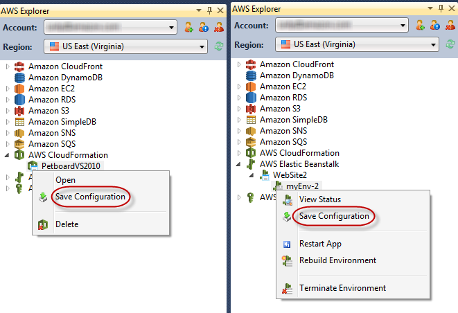

.. Copyright 2010-2016 Amazon.com, Inc. or its affiliates. All Rights Reserved.

   This work is licensed under a Creative Commons Attribution-NonCommercial-ShareAlike 4.0
   International License (the "License"). You may not use this file except in compliance with the
   License. A copy of the License is located at http://creativecommons.org/licenses/by-nc-sa/4.0/.

   This file is distributed on an "AS IS" BASIS, WITHOUT WARRANTIES OR CONDITIONS OF ANY KIND,
   either express or implied. See the License for the specific language governing permissions and
   limitations under the License.

.. _tkv-deployment-tool:

##########################
Standalone Deployment Tool
##########################

.. meta::
   :description: Deployment using the standalone deployment tool.
   :keywords: standalone deployment, Elastic Beanstalk, CloudFormation

.. note:: Standalone Deployment Tool options related to |CFN| deployments and incremental
   deployments to |EB| are obsolete in the current version and should not be used.

   For information about using the preferred :guilabel:`Publish to Elastic Beanstalk` wizard, see
   :ref:`tkv-deploy-beanstalk`.

The |TVS| includes a command line tool that provides the same functionality as the deployment
wizard. You can use the standalone deployment tool in your build pipeline or in other scripts to
automate deployments to |EB|.

The deployment tool supports both initial deployments and redeployments. If you used the deployment
tool to deploy your application, you can use the deployment wizard in Visual Studio to redeploy it,
and vice versa.

The deployment tool consumes a configuration file that specifies parameter values for the
deployment. If you used the deployment wizard in Visual Studio to deploy your application, you can
generate a configuration file either from AWS Explorer or the last step in the wizard.

.. note:: Because the deployment configuration includes the credentials that were used for
   deployment, you should keep the configuration file in a secure location.

To deploy your web application with the deployment tool, package the application in a .zip file.
For more information about how to package your application for deployment, go to `How to: Create a
Web Deployment Package in Visual Studio <https://msdn.microsoft.com/en-us/library/dd465323.aspx>`_ on
MSDN.

.. _tkv-install-and-invoke:

Deployment Tool Installation and Invocation
===========================================

The deployment tool is typically installed in the following directory:

.. code-block:: none

    C:\Program Files\AWS Tools\Deployment Tool\awsdeploy.exe

Or, on Microsoft Windows 64-bit system, in the following directory:

.. code-block:: none

    C:\Program Files (x86)\AWS Tools\Deployment Tool\awsdeploy.exe

Invocation Syntax
-----------------

.. code-block:: none

    awsdeploy [options] configFile

The configuration file must be the last item specified on the command line.

Command line options can be specified using a forward slash (/) or hyphen (-).

Except for the :code:`D` option, each command line option has a long form and a single letter
abbreviation. For example, you can specify silent mode in any of the following ways.

.. code-block:: none

    /s
    -s
    /silent
    -silent

Other command line options follow a similar form.

The following table shows the available command line options.

.. list-table::
    :header-rows: 1
    :widths: 2 3

    * - Option
      - Description

    * - /s, /silent, -s, -silent
      - Do not output messages to the console.

    * - /v, /verbose, -v, -verbose
      - Send more detailed information about the deployment to the console.

    * - /r, /redeploy, -r, -redeploy
      - Do not create stack. Deploy to existing stack. This option does not change the |CFN|
        configuration.

    * - /u, /updateStack, -u, -updateStack
      - Update the |CFN| configuration for an existing deployment. Do not redeploy the application.
        ** (Obsolete. Do not use.) **

    * - /w, /wait, -w, -wait
      - Block until deployment is complete. This option is useful for scripts that need to take some
        action after the deployment is complete.

    * - /l <logfile>, /log <logfile>, -l <logfile>, -log <logfile>
      - Log debugging information to the specified log file.

    * - /D<key>=<value>, -D<key>=<value>
      - Override a configuration setting from the command line. For more information, see the section
        of the configuration file.

Output and Exit Codes
---------------------

Warnings and errors are output to the console. If the log option is specified, additional logging
output is sent to the log file.

The deployment tool uses the following exit codes.

.. list-table::
    :header-rows: 1
    :widths: 2 3

    * - Key and Value
      - Description

    * - 0
      - Success

    * - 1
      - Invalid argument

    * - 3
      - Failed deployment

If the deployment is successful, the deployment tool will output the URL for the deployed
application.

Configuration File Samples
--------------------------

You use a configuration file to specify the action of the deployment tool. The |TVS| includes three
sample configuration files:

* |EB| deployment

* |CFN| single instance deployment

* |CFN| load-balanced deployment

Sample Web App
--------------

A sample web app (in a .zip file archive) that you can deploy using the deployment tool is also
included in the |TVS|. You can find these files in the :code:`Samples` subdirectory of the
directory where the deployment tool is installed.

You can use the :code:`D` command line option to override settings in the configuration file:

.. code-block:: none

    /D<key>=<value>

or

.. code-block:: none

    -D<key>=<value>

You can specify the :code:`D` option multiple times to override multiple configuration file
settings. If you repeat the same key with different values on the command line, the deployment tool
will use the last value specified.

.. _deployment-tool-configuration-file-format:

Deployment Tool Configuration File Format
=========================================

The configuration files provide the same information you would specify in the deployment wizard. The
formatting of the configuration files divides the configuration into sections that correspond to the
pages in the deployment wizard.

.. _aws-aeb-deployment-configuration-file:

|EB| Deployment Configuration File
-----------------------------------

The following configuration parameters are for deployments using |EB|.

For a walkthrough of the use of the standalone deployment tool to deploy to |EB|, go to the
:eb-dg:`Developer Guide <deploy_NET_standalone_tool>`.

General Settings
~~~~~~~~~~~~~~~~

.. code-block:: none

    /Daws:autoscaling:launchconfiguration.SecurityGroups=RDPOnly,HTTPOnly

.. list-table::
    :header-rows: 1
    :widths: 25 30

    * - Key and Value
      - Description

    * - DeploymentPackage = archive.zip
      - Relative path to the web deployment archive. This path is relative to your working directory
        (that is, the directory from which you invoke the deployment tool).

    * - IncrementalPushLocation
      - (Obsolete: Do not use) If specified, incremental deployment is enabled. The value specifies
        a location (for example, :file:`C:\\Temp\\VS2008App1`) where a Git repository will be
        created to store the versioned contents of the deployment package.

    * - Template = ElasticBeanstalk
      - Can be :code:`Elastic Beanstalk` or :code:`ElasticBeanstalk`.

    * - Application.Name
      - Specifies a name for the application. This value is required.

    * - Application.Description
      - Specifies an optional description for the application.

    * - Application.Version
      - Specifies a version string for the application. If you are using incremental deployment,
        this value is ignored. |EB| uses the Git commit ID for the version string.

    * - Region = us-east-1
      - Target |regions-and-endpoints|_.

    * - UploadBucket = awsdeployment-us-east-1-samples
      - |S3| bucket where the deployment materials will be stored. If this bucket doesn't exist, it
        will be created. If you use the deployment wizard, it generates the bucket name for you.

    * - KeyPair = default
      - |EC2| key pair for signing in to the instance. The key pair must exist before deployment.
        (The deployment wizard allows you to create the key pair during deployment.)

    * - AWSAccessKey = DEPLOYMENT_CREDENTIALS_HERE

        AWSSecretKey = DEPLOYMENT_CREDENTIALS_HERE
      - AWS access key and secret key used to create the stack and deploy the application to |EB|.
        We do not recommend using these parameters to specify credentials. Instead, create a profile
        for the credentials and use :code:`AWSProfileName` to reference the profile. For more
        information, see :ref:`creds`.

    * - AWSProfileName = {profile_name}
      - The profile used to create the stack and deploy the application to |EB|.

    * - aws:autoscaling:launchconfiguration.SecurityGroups = default
      - The names of the security groups for the |EC2| instance. If you specify multiple security
        groups, separate them with commas.

        :code:`/Daws:autoscaling:launchconfiguration.SecurityGroups=RDPOnly,HTTPOnly`

        The security groups must already exist and must allow ingress on port 80 (HTTP). For
        information about how to create security groups, see :ref:`tkv-sg`

Environment Settings
~~~~~~~~~~~~~~~~~~~~

.. list-table::
    :header-rows: 1
    :widths: 2 3

    * - Key and Value
      - Description

    * - Environment.Name
      - Specifies a name for your |EB| environment. This value is required.

    * - Environment.Description
      - Optional. Specifies a description for your environment.

    * - Environment.CNAME
      - Optional. Specifies the URL prefix for your application. If you do not specify this value,
        |EB| will derive the prefix from your environment name.

Container Settings
~~~~~~~~~~~~~~~~~~

.. list-table::
    :header-rows: 1
    :widths: 2 3

    * - Key and Value
      - Description

    * - Container.TargetRuntime = 4.0
      - Specifies the target runtime for the .NET Framework. Possible values are 2.0 or 4.0. The
        following .NET Framework versions are mapped to a target runtime of 2.0:

         * .NET Framework 2.0
         * .NET Framework 3.0
         * .NET Framework 3.5

        The following .NET Framework versions are mapped to a target runtime of 4.0:

         * .NET Framework 4.0
         * .NET Framework 4.5

        The :ref:`deployment wizard <tkv-deploy-beanstalk>` in the |TVS| allows you to specify the
        .NET Framework version. The wizard then maps the .NET Framework version to the appropriate
        target runtime version.

    * - Container.Enable32BitApplications = false
      - If the application is 32-bit, specify :code:`true`. If the application is 64-bit, specify
        :code:`false`.

    * - Container.ApplicationHealthcheckPath = /
      - This URL is relative to the root server URL. For example, if the full URL is
        :code:`example.com/site-is-up.html`, you would type :code:`/site-is-up.html`. The setting
        applies only when you use the load balanced template. It is ignored when you use the single
        instance template. The responsiveness of the application at this URL affects into the actions
        taken by the load balancer and auto scaler. If the application is unresponsive or responds
        slowly, the load balancer will direct incoming network traffic to other |EC2| instances,
        and the auto scaler may add additional |EC2| instances.

    * - Container.InstanceType = t1.micro
      - The `type of Amazon EC2 instance <http://aws.amazon.com/ec2/instance-types/>`_ to use.
        The Micro instance shown here is the |ec2-pricing|_ type of instance.

    * - Container.AmiID
      - Specifies a custom Amazon Machine Image (AMI). For more information about how to create a
        custom AMI, go to :eb-dg:`Using Custom AMIs <using-features.customami>` in the
        |EB-dg|_ and :ref:`tkv-create-ami-from-instance`.

    * - Container.NotificationEmail
      - Optional. Specifies an email address for deployment status notifications.

.. _amazon-cloudformation-deployment-configuration-file:

|CFN| Deployment Configuration File
-----------------------------------

.. note:: Deployments to |CFN| using the Standalone Deployment Tool are deprecated.

The following configuration parameters are taken from the load balanced template.

*General Settings*

.. list-table::
    :header-rows: 1
    :widths: 2 3

    * - Key and Value
      - Description

    * - DeploymentPackage = archive.zip
      - Relative path to the web deployment archive. This path is relative to your working directory
        (that is, the directory from which you invoke the deployment tool). If you are updating a
        deployment (:code:`/updateStack` switch), this parameter is ignored.

    * - Region = |region-api-default|
      - Target region.

    * - Template = LoadBalanced
      - The value for :code:`Template` can be :code:`SingleInstance` or :code:`LoadBalanced` or a
        file path to a custom |CFN| template. For more information, see :ref:`tkv-custom-templates`

    * - UploadBucket = awsdeployment-us-east-1-samples
      - |S3long| (|S3|) bucket where the deployment materials will be stored. If the bucket doesn't
        exist, it will be created. If you use the deployment wizard, it generates this bucket name
        for you. If you used the wizard for a deployment and are redeploying, this parameter will be
        ignored. The deployment tool automatically uses the bucket that was used in the original
        deployment from the wizard.

    * - KeyPair = default
      - |EC2long| (|EC2|) key pair for signing in to the instance. The key pair must exist before
        deployment. (The deployment wizard allows you to create the key pair during deployment.)

    * - AWSAccessKey = DEPLOYMENT_CREDENTIALS_HERE
        AWSSecretKey = DEPLOYMENT_CREDENTIALS_HERE
      - The AWS access key and secret key used to create the stack and deploy the application to |CFN|.
        We do not recommend using these parameters to specify credentials. Instead, create a profile
        for the credentials and use :code:`AWSProfileName` to reference the profile. For more
        information, see :ref:`creds`.

    * - AWSProfileName = {profile_name}
      - The profile used to create the stack and deploy the application to |CFN|.

Template Parameters
~~~~~~~~~~~~~~~~~~~

In addition to the following parameters, the load balanced template supports numerous other
parameters to customize load balancing and |AS| behavior.

.. list-table::
    :header-rows: 1
    :widths: 2 3

    * - Key and Value
      - Description

    * - Template.InstanceType = t1.micro
      - The `type of Amazon EC2 instance <http://aws.amazon.com/ec2/instance-types/>`_ to use.
        The Micro instance shown here is the `least expensive <ec2-pricing_>`_ type of instance.

    * - Template.SecurityGroup = default
      - The security group for the |EC2| instance. This security group must have already been
        created and must allow ingress on port 80 (HTTP). For information about how to create a
        security groups, see :ref:`tkv-sg`.

    * - Environment.PARAM1 =
        Environment.PARAM2 =
        Environment.PARAM3 =
        Environment.PARAM4 =
        Environment.PARAM5 =
      - These values are made available to the deployed application through the :code:`appSettings`
        in the :file:`Web.config` file. For more information, go to the
        `MSDN library <http://msdn.microsoft.com/en-us/library/610xe886.aspx>`_.

    * - Environment.AWSAccessKey = APP_CREDENTIALS_HERE
        Environment.AWSSecretKey = APP_CREDENTIALS_HERE
      - The access key and secret key used by the deployed application to access AWS services. We do
        not recommend using these parameters to specify credentials. Instead, create a profile for
        the credentials and use :code:`AWSProfileName` to reference the profile. For more information,
        see :ref:`creds`.

    * - AWSProfileName = {profile_name}
      - The profile used by the deployed application to access AWS services. .

Container Settings
~~~~~~~~~~~~~~~~~~

.. code-block:: none

    SolutionStack="64bit Windows Server 2008 R2 running IIS 7.5"

.. code-block:: none

    SolutionStack="64bit Windows Server 2012 running IIS 8"

.. list-table::
    :header-rows: 1

    * - Key and Value
      - Description

    * - SolutionStack="64bit Windows Server 2012 running IIS 8"
      - Specifies the version of Windows Server and Internet Information Services (IIS) to which to
        deploy. Valid values are: SolutionStack="64bit Windows Server 2008 R2 running IIS 7.5" or
        SolutionStack="64bit Windows Server 2012 running IIS 8" If not specified, the default is 64bit
        Windows Server 2012 running IIS 8.0. You can use *Container.Type* as an alias for SolutionStack.

    * - Container.TargetRuntime = 4.0
      - Specifies the target runtime for the .NET Framework. Possible values are 2.0 or 4.0.

        The following .NET Framework versions are mapped to a target runtime of 2.0:
           * .NET Framework 2.0
           * .NET Framework 3.0
           * .NET Framework 3.5

        The following .NET Framework versions are mapped to a target runtime of 4.0:
           * .NET Framework 4.0
           * .NET Framework 4.5

        The :ref:`deployment wizard <tkv-deploy-cloudform>` in the |TVS| allows you to specify the .NET
        Framework version. The wizard then maps the .NET Framework version to the appropriate target
        runtime version.

    * - Container.Enable32BitApplications = false
      - If the application is 32-bit, specify :code:`true`. If the application is 64-bit, specify
        :code:`false`.

    * - Container.ApplicationHealthcheckPath = /
      - This URL is relative to the root server URL. For example, if the full URL is
        :code:`example.com/site-is-up.html`, you would type :code:`/site-is-up.html`.

        The setting applies only when you use the load balanced template. It is ignored when you are
        using the single instance template. The responsiveness of the application at this URL affects
        the actions taken by the load balancer and auto scaling. If the application is unresponsive
        or responds slowly, the load balancer will direct incoming network traffic to other |EC2|
        instances, and the auto scaler may add additional |EC2| instances.

Stack Creation Settings
~~~~~~~~~~~~~~~~~~~~~~~

.. list-table::
    :header-rows: 1

    * - Key and Value
      - Description

    * - Settings.SNSTopic
      - SNS topic to use for deployment messages.

    * - Settings.CreationTimeout = 0
      - The amount of time to allow for the creation of the stack. A value of zero means there is no
        time limit.

    * - Settings.RollbackOnFailure = false
      - If this value is :code:`true`, the deployment tool tears down the stack if the deployment
        fails.

.. _update-the-configuration-for-an-existing-deployment:

How to Update the Configuration for an Existing Deployment
==========================================================

You can use the :code:`updateStack` feature of the deployment tool to modify the |CFN| configuration
of an existing deployment. This configuration |mdash| the application's environment |mdash| includes
the cloud resources your application runs on and has access to. The :code:`updateStack` feature does
not change or redeploy the application; it only updates the application's environment. In this way,
the :code:`updateStack` feature complements the redeployment feature. Redeployment provides a way to
update your application without changing the environment.

There are various scenarios in which you might use :code:`updateStack`. For example, if you develop
your application using the single instance template, as the application nears production readiness,
you could update its configuration to use a load balanced template, either for public beta testing
or live release deployment. In a related scenario, a deployment using a load-balanced configuration
could be optimized by modifying some of the configuration parameters |mdash| for example, by
increasing the maximum number of supporting EC2 instances or changing the size of the instances, say
from micro to large. You can use the :code:`updateStack` feature of the deployment tool to implement
either of these scenarios.

There are scenarios in which you might use both the :code:`/updateStack` option and the
:code:`/redeploy` option, effectively modifying both the application itself and the environment in
which the application is running. In some cases, this approach is more efficient than just
performing a regular deployment. For example, you might change your environment to add an |S3|
bucket and then update your application to use that bucket. With a combination of
:code:`/updateStack` and :code:`/redeploy`, you could implement both changes, but leave any already
provisioned |EC2| instances up and running. A regular deployment would result in all of the
environment being taken down and rebuilt.

The :code:`updateStack` feature is available only through the deployment tool. It is not available
through the deployment wizard in Visual Studio. You can use :code:`updateStack` to update a
deployment that was initially deployed through the deployment wizard, but not vice versa.

The invocation syntax for updating a deployment is similar to the syntax for a new deployment.

.. code-block:: none

    awsdeploy /updateStack [other options] updatedConfigFile

Keep the following in mind when you attempt to update a deployment:

* You cannot update a deployment that is in the process of being created or taken down.

* The specified config file must use the same value for the :code:`StackName` parameter as the
  original deployment.

* You cannot use :code:`updateStack` to change the region for your deployment. However, you can change
  the Availability Zones for your deployment.

* If you use :code:`updateStack` to transition your deployment from single instance to load balanced,
  the endpoint for your deployment will necessarily change. In the single instance case, the
  endpoint refers to an |EC2| instance. In the load balanced template, the endpoint refers to the
  |ELB| load balancer, a computer that distributes computing load across all EC2 instances.
  Therefore, if you are using a CNAME record to associate a domain name with your deployment, you
  should update the CNAME record so that it points to the load balancer of the load balanced
  template.

The deployment tool implements the :code:`updateStack` feature by calling the |CFN|
:cfn-api:`UpdateStack <UpdateStack>` API. For more information about |CFN|, go to the
|CFN-ug|_.

.. toctree::
    :titlesonly:
    :maxdepth: 1

    custom-template-tkv

