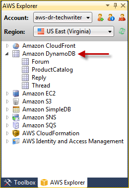
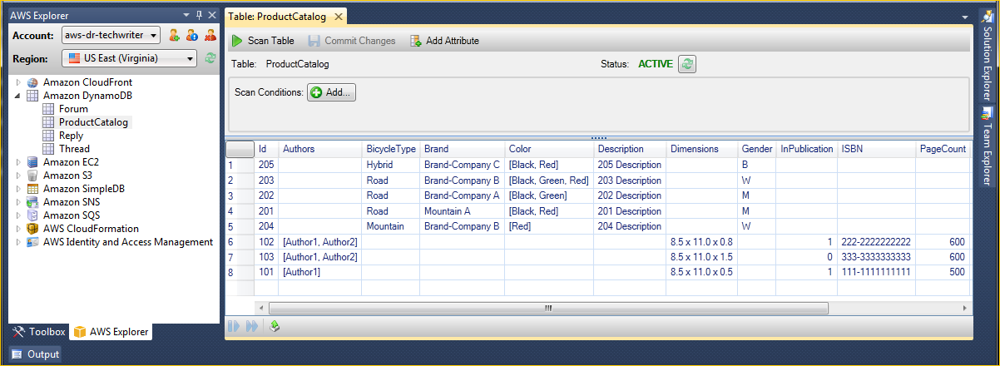
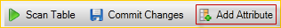
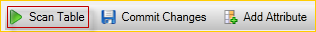
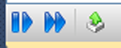

.. Copyright 2010-2016 Amazon.com, Inc. or its affiliates. All Rights Reserved.

   This work is licensed under a Creative Commons Attribution-NonCommercial-ShareAlike 4.0
   International License (the "License"). You may not use this file except in compliance with the
   License. A copy of the License is located at http://creativecommons.org/licenses/by-nc-sa/4.0/.

   This file is distributed on an "AS IS" BASIS, WITHOUT WARRANTIES OR CONDITIONS OF ANY KIND,
   either express or implied. See the License for the specific language governing permissions and
   limitations under the License.

.. _tkv-dynamodb:

#############################
Using |DDB| from AWS Explorer
#############################

.. meta::
   :description: Using |DDB| from AWS Explorer
   :keywords: |DDB|, table

|DDBlong| is a fast, highly scalable, highly available, cost-effective, non-relational database
service. |DDB| removes traditional scalability limitations on data storage while maintaining low
latency and predictable performance. The |TVS| provides functionality for working with |DDB| in
a development context. For more information about |DDB|, see |DDB|_
on the AWS website.

In the |TVS|, AWS Explorer displays all of the |DDB| tables associated with the active AWS
account.

.. _tkv-dynamodb-create-table:

Creating an |DDB| Table
=======================

You can use the |TVS| to create a |DDB| table.

**To create a table in AWS Explorer**

1. In AWS Explorer, open the context (right-click) menu for :guilabel:`Amazon DynamoDB`, and then
   choose :guilabel:`Create Table`.

2. In the :guilabel:`Create Table` wizard, in :guilabel:`Table Name`, type a name for the table.

3. In the :guilabel:`Hash Key Name` field, type a primary hash key attribute and from the
   :guilabel:`Hash Key Type` buttons, choose the hash key type. |DDB| builds an unordered hash
   index using the primary key attribute and an optional sorted range index using the range primary
   key attribute. For more information about the primary hash key attribute, go to the 
   :ddb-dg:`Primary Key <DataModel.html#DataModelPrimaryKey>` section in the |DDB-dg|.

4. (Optional) Select :guilabel:`Enable Range Key`. In the :guilabel:`Range Key Name` field, type a
   range key attribute, and then from the :guilabel:`Range Key Type` buttons, choose a range key
   type.

5. In the :guilabel:`Read Capacity` field, type the number of read capacity units. In the
   :guilabel:`Write Capacity` field, type the number of write capacity units. You must specify a
   minimum of three read capacity units and five write capacity units. For more information about
   read and write capacity units, go to 
   :ddb-dg:`Provisioned Throughput in DynamoDB <HowItWorks.ProvisionedThroughput>`.

6. (Optional) Select :guilabel:`Enable Basic Alarm` to alert you when your table's request rates are
   too high. Choose the percentage of provisioned throughput per 60 minutes that must be exceeded
   before the alert is sent. :guilabel:`In Send Notifications To`, type an email address.

7. Click :guilabel:`OK` to create the table.

.. figure:: images/dynamodb-create-table.png
    :scale: 65

For more information about |DDB| tables, go to 
:ddb-dg-deep:`Data Model Concepts - Tables, Items, and Attributes <DataModel.html#DataModelTableItemAttribute>`.

.. _tkv-dynamodb-grid-view:

Viewing an |DDB| Table as a Grid
================================

To open a grid view of one of your |DDB| tables, in AWS Explorer, double-click the subnode that
corresponds to the table. From the grid view, you can view the items, attributes, and values stored
in the table. Each row corresponds to an item in the table. The table columns correspond to
attributes. Each cell of the table holds the values associated with that attribute for that item.

An attribute can have a value that is a string or a number. Some attributes have a value that
consists of a *set* of strings or numbers. Set values are displayed as a comma-separated list
enclosed by square brackets.

.. _tkv-dynamodb-editing:

Editing and Adding Attributes and Values
========================================

By double-clicking a cell, you can edit the values for the item's corresponding attribute. For
set-value attributes, you can also add or delete individual values from the set.

.. figure:: images/dynamodb-single-value-cell-edit.png
    :scale: 85

In addition to changing the value of an attribute, you can also, with some limitations, change the
format of the value for an attribute. For example, any number value can be converted into a string
value. If you have a string value, the content of which is a number, such as 125, the cell editor
enables you to convert the format of the value from string to number. You can also convert a
single-value to a set-value. However, you cannot generally convert from a set-value to a
single-value; an exception is when the set-value has, in fact, only one element in the set.

.. figure:: images/dynamodb-set-value-attribute.png
    :scale: 85

After editing the attribute value, choose the green check mark to confirm your changes. If you want
to discard your changes, choose the red X.

After you have confirmed your changes, the attribute value will be displayed in red. This indicates
the attribute has been updated, but that the new value has not been written back to the |DDB|
database. To write your changes back to |DDB|, choose :guilabel:`Commit Changes`. To discard your
changes, choose :guilabel:`Scan Table` and when the Toolkit asks if you would like to commit your
changes before the Scan, choose :guilabel:`No`.

*Adding an Attribute*

From the grid view, you can also add attributes to the table. To add a new attribute, choose
:guilabel:`Add Attribute`.

In the :guilabel:`Add Attribute` dialog box, type a name for your attribute, and then choose
:guilabel:`OK`.

.. figure:: images/dynamodb-add-attribute.png
    :scale: 85

To make the new attribute become part of the table, you must add a value to it for at least one item
and then choose the :guilabel:`Commit Changes` button. To discard the new attribute, just close the
grid view of the table without choosing :guilabel:`Commit Changes`.

.. figure:: images/dynamodb-commit-new-attribute-value.png
    :scale: 85

.. _tkv-dynamodb-scan:

Scanning an |DDB| Table
=======================

You can perform Scans on your |DDB| tables from the Toolkit. In a Scan, you define a set of criteria
and the Scan returns all items from the table that match your criteria. Scans are expensive
operations and should be used with care to avoid disrupting higher priority production traffic on
the table. For more information about using the Scan operation, go to the |DDB-dg|.

**To perform a Scan on an DynamoDB table from AWS Explorer**

1. In the grid view, choose the :guilabel:`scan conditions: add` button.

2. In the Scan clause editor, choose the attribute to match against, how the value of the attribute
   should be interpreted (string, number, set value), how it should be matched (for example Begins
   With or Contains), and the literal value it should match.

3. Add more Scan clauses, as needed, for your search. The Scan will return only those items that match
   the criteria from all of your Scan clauses. The Scan will perform a case-sensitive comparison
   when matching against string values.

4. On the button bar at the top of the grid view, choose :guilabel:`Scan Table`.

To remove a Scan clause, choose the red button with the white line to the right of each clause.

.. figure:: images/dynamodb-scan-results.png
    :scale: 85

To return to the view of the table that includes all items, remove all Scan clauses and choose
:guilabel:`Scan Table` again.

*Paginating Scan Results*

At the bottom of the view are three buttons.

The first two blue buttons provide pagination for Scan results. The first button will display an
additional page of results. The second button will display an additional ten pages of results. In
this context, a page is equal to 1 MB of content.

*Export Scan Result to CSV*

The third button exports the results from the current Scan to a CSV file.

