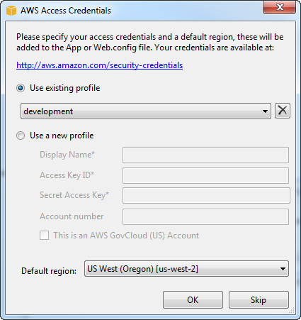

.. Copyright 2010-2016 Amazon.com, Inc. or its affiliates. All Rights Reserved.

   This work is licensed under a Creative Commons Attribution-NonCommercial-ShareAlike 4.0
   International License (the "License"). You may not use this file except in compliance with the
   License. A copy of the License is located at http://creativecommons.org/licenses/by-nc-sa/4.0/.

   This file is distributed on an "AS IS" BASIS, WITHOUT WARRANTIES OR CONDITIONS OF ANY KIND,
   either express or implied. See the License for the specific language governing permissions and
   limitations under the License.

.. _tkv_setup:

####################
Setting Up the |TVS|
####################

.. meta::
   :description: How to set up the |TVS|.
   :keywords: configuration, prerequisites, region, credentials, uninstall

Follow the steps in this topic to install and configure the |TVS|.

.. _prereqs:

Prerequisites
=============

The |TVS| has the following prerequisites.

* An AWS account. To get an AWS account, go to the `AWS home page <http://aws.amazon.com/>`_ and choose
  :guilabel:`Create an AWS Account`. This account will enable you to use AWS services.

* Supported operating systems: Microsoft Windows 8, Windows 7, and Windows Vista.

  We recommend that you install the latest service packs and updates for the version of Windows
  you are using.

* Visual Studio 2010 or later.

  We recommend that you install the latest service packs and updates.

.. note:: You can install the |TVS| on Visual Studio Express, but the installation includes only the AWS
   project templates and the :ref:`standalone deployment tool <tkv-deployment-tool>`. Visual
   Studio Express does not support third-party extensions, such as AWS Explorer.

.. _install:

Installation
============

The |TVS| is part of the |TFW|. If you have Visual Studio 2010 or later, install the |TFW| as
follows:

**To install the |TFW|**

1. Go to `Toolkit for Visual Studio <http://aws.amazon.com/visualstudio>`_.

2. In the :guilabel:`Download` section, choose **|TVS|** to download the installer.

3. To start the installation, run the downloaded installer and follow the instructions.

  .. tip:: By default, the |TVS| is installed in the *Program Files* directory, which requires 
     administrator privileges. To install the |TVS| as a non-administrator, specify a different 
     installation directory.

  .. note:: You can install the |TVS| for Visual Studio 2008 from
     http://sdk-for-net.amazonwebservices.com/latest/AWSToolkitForVisualStudio2008.msi, but this
     version of the toolkit is no longer supported.

.. _creds:

Specifying Credentials
======================

Before you can use the |TVS|, you must provide one or more sets of valid AWS credentials. These
credentials allow you to access your AWS resources through the |TVS|. They are also used to sign
programmatic web services requests, so AWS can verify the request comes from an authorized source.

.. important:: AWS credentials consist of an access key and a secret key. We recommend that you do 
   not use your account's root credentials. Instead, create one or more |IAM| users, and then use 
   those credentials. For more information, see :aws-blogs-net:`Using IAM Users 
   <Tx2O8RZZ1RLE898/Using-IAM-Users-Access-Key-Management-for-NET-Applications-Part-2>`
   and :aws-gr:`Best Practices for Managing AWS Access Keys <aws-access-keys-best-practices>`.

The |TVS| supports multiple sets of credentials from any number of accounts. Each set is referred to
as a *profile*. When you add a profile to |TVS|, the credentials are encrypted and stored in the SDK
Store, which is also used by the |sdk-net|_ and |TWP-ug|_. The SDK Store is separate from
your project directories so that it cannot be unintentionally committed to a public repository. To
use the |TVS|, you must add at least one profile to the SDK Store.

**To add a profile to the SDK Store**

1. Open AWS Explorer. In Visual Studio, choose the :guilabel:`View` menu, and then choose
   :guilabel:`AWS Explorer` or press :kbd:`Ctrl+K`, and then press the :kbd:`A` key.

2. Choose the :guilabel:`New Account Profile` icon to the right of the :guilabel:`Profile` list.

   .. image:: images/add_profile.png
       :scale: 85

3. In the :guilabel:`New Account Profile` dialog box, type the following data:

   :guilabel:`Profile Name`
      (Required) The profile's display name.

   :guilabel:`Access Key ID`
      (Required) The access key.

   :guilabel:`Secret Access Key`
      (Required) The secret key.

   :guilabel:`Account Number`
      (Optional) The credential's account number. The |TVS| uses the account number to construct
      Amazon resource names (ARNs).

   Account Type
     (Required) The account type. This entry determines which regions are displayed in AWS
     Explorer when you specify this profile. 

   * :guilabel:`Standard AWS Account`
   
     * If you choose **|GOVCLOUD-US| Account**, AWS Explorer displays only the 
       |GOVCLOUD-US|_ region.

     * If you choose :guilabel:`Amazon AWS Account – China (Beijing) Region`, AWS Explorer 
       displays only the |cnnorth1-name|.
       
       .. figure:: images/tkv-account-add.png
          :scale: 100

4. To add the profile to the SDK Store, choose :guilabel:`OK`. To use a profile in your project, choose
   the profile name. |TVS| adds a reference to the profile to the project's :file:`App.config` or
   :file:`Web.config` file.

After you have added the first profile:

* To add another profile, repeat the procedure.

* To delete a profile, choose it, and then choose the :guilabel:`Delete Profile` icon.

* To edit a profile, choose the :guilabel:`Edit Profile` icon to display the :guilabel:`Edit Profile`
  dialog box.

  For example, if you have :aws-gr:`rotated an IAM user's credentials 
  <aws-access-keys-best-practices>` |mdash| a recommended
  practice |mdash| you can edit the profile to update the user's credentials in the SDK Store. For
  more information, see :aws-blogs-net:`IAM Credential Rotation 
  <Tx2DJQU2MKGR463/IAM-Credential-Rotation-Access-Key-Management-for-NET-Applications-Part-3>`.

You can also add profiles to the SDK Store when you create an AWS project. Before Visual Studio
creates the project files, it displays the :guilabel:`AWS Access Credentials` dialog box. You can
choose a profile from the SDK Store or create one.

.. _uninstall:

Uninstalling
============

To uninstall the |TVS|, you must uninstall the |TFW|. To uninstall the |TFW|, perform the
following steps:

**To uninstall the |TFW|**

1. In Control Panel, open :guilabel:`Programs and Features`.

  .. tip:: To open :guilabel:`Programs and Features` directly, from a command prompt, run the following: 
     :code:`appwiz.cpl`

2. Choose :guilabel:|TFW|, and then choose :guilabel:`Uninstall`.

   .. figure:: images/uninstall.png
      :scale: 100

3. If prompted, choose :guilabel:`Yes`.

Uninstalling the |TFW| does not remove the Samples directory. This directory is preserved in case
you have modified the samples. You will have to manually remove this directory.
