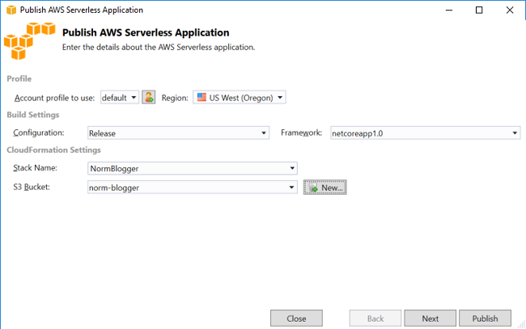
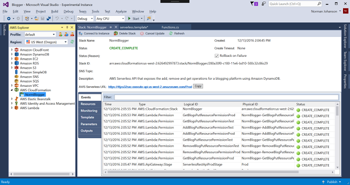
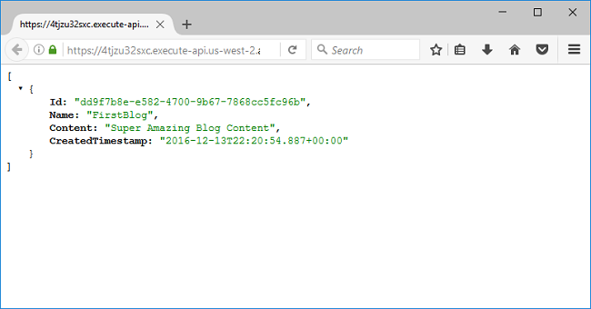

.. Copyright 2010-2017 Amazon.com, Inc. or its affiliates. All Rights Reserved.

   This work is licensed under a Creative Commons Attribution-NonCommercial-ShareAlike 4.0
   International License (the "License"). You may not use this file except in compliance with the
   License. A copy of the License is located at http://creativecommons.org/licenses/by-nc-sa/4.0/.

   This file is distributed on an "AS IS" BASIS, WITHOUT WARRANTIES OR CONDITIONS OF ANY KIND,
   either express or implied. See the License for the specific language governing permissions and
   limitations under the License.

.. _lambda-build-serverless-application:

################################################################
Tutorial: Build and Test a Serverless Application with |LAMlong|
################################################################

.. meta::
   :description: Running Serverless Applications with |LAMlong|

You can build a serverless |LAM| application by using an |TVSlong|
template. The |LAM| project templates include one for an :guilabel:`AWS Serverless Application`, which
is the |TVSlong| implementation of the `AWS Serverless Application Model (AWS SAM) <https://github.com/awslabs/serverless-application-model>`_. 
Using this project type you can develop a collection of |LAMlong| functions and deploy them with any 
necessary AWS resources as a whole application, using |CFNlong| to orchestrate the deployment.

For prerequisites and information about setting up the |TVSlong|, see :doc:`lambda-index`.

.. toctree::
    :titlesonly:
    :maxdepth: 1

Create a New AWS Serverless Application Project
===============================================

#. Open Visual Studio, and on the :guilabel:`File` menu, choose :guilabel:`New`, :guilabel:`Project`.
#. In the :guilabel:`Installed` pane, choose  Visual C# and the |LAM| Project template.

   There are two types of project to choose from:

   * |LAMlong| projects for creating a project to develop and deploy an individual |LAM| function.
   * AWS Serverless Applications projects for creating |LAM| functions with a serverless |CFNlong| template.
     AWS serverless applications enable you to define more than just the function. For example,
     you can simultaneously
     create a database, add |IAM| roles, etc., with serverless deployment. AWS serverless applications
     also enable you to deploy multiple functions at one time.

     .. image:: images/serverless-new-project.png
        :alt: Project types for AWS Lambda Serverless projects

#. Select :guilabel:`AWS Serverless Application with Tests (.NET Core)` and name it *`Blogger`*.
   The :guilabel:`Select Blueprint` page is displayed showing several |LAM| function templates.

   .. image:: images/serverless-blueprints.png
      :alt: Blueprints for an AWS Lambda Serverless project

#. Choose the :guilabel:`Blog API using |DDB| blueprint`, and then choose :guilabel:`Finish`
   to create the Visual Studio project.

Examine the Files in the Serverless Application
===============================================

**Blog.cs**

:code:`Blog.cs` is a simple class used to represent the blog items that are stored in |DDBlong|.

**Functions.cs**

:code:`Functions.cs` defines the C# functions to expose as |LAM| functions. There are four functions
defined to manage a blog platform:

* :code:`GetBlogsAsync`: gets a list of all the blogs.
* :code:`GetBlogAsync`: gets a single blog identified by the query parameter ID or by the ID added
  to the URL resource path.
* :code:`AddBlogAsync`: adds a blog to |DDB| table.
* :code:`RemoveBlogAsync`: removes a blog from the |DDB| table.

Each of these functions accepts an `APIGatewayProxyRequest <https://github.com/aws/aws-lambda-dotnet/blob/master/Libraries/src/Amazon.Lambda.APIGatewayEvents/APIGatewayProxyRequest.cs>`_
object and returns an `APIGatewayProxyResponse <https://github.com/aws/aws-lambda-dotnet/blob/master/Libraries/src/Amazon.Lambda.APIGatewayEvents/APIGatewayProxyResponse.cs>`_.

You expose these |LAM| functions as HTTP APIs by using |ABPlong|. The :code:`APIGatewayProxyRequest`
contains all the information representing the HTTP request. The :code:`GetBlogAsync` task finds
the blog ID in the resource path or query string.

.. code-block:: csharp

        public async Task GetBlogAsync(APIGatewayProxyRequest request, ILambdaContext context)
        {
            string blogId = null;
            if (request.PathParameters != null && request.PathParameters.ContainsKey(ID_QUERY_STRING_NAME))
                blogId = request.PathParameters[ID_QUERY_STRING_NAME];
            else if (request.QueryStringParameters != null && request.QueryStringParameters.ContainsKey(ID_QUERY_STRING_NAME))
                blogId = request?.QueryStringParameters[ID_QUERY_STRING_NAME];
            ...
        }

The default constructor for this class passes the name of the |DDB| table storing the blogs as
an environment variable. This environment variable is set when |LAM| deploys the function.

.. code-block:: csharp

        public Functions()
        {
            // Check if a table name was passed in through environment variables and, if so,
            // add the table mapping
            var tableName = System.Environment.GetEnvironmentVariable(TABLENAME_ENVIRONMENT_VARIABLE_LOOKUP);
            if(!string.IsNullOrEmpty(tableName))
            {
                AWSConfigsDynamoDB.Context.TypeMappings[typeof(Blog)] = new Amazon.Util.TypeMapping(typeof(Blog), tableName);
            }

            var config = new DynamoDBContextConfig { Conversion = DynamoDBEntryConversion.V2 };
            this.DDBContext = new DynamoDBContext(new AmazonDynamoDBClient(), config);
        }

**serverless.template**

The :code:`serverless.template` is the |CFNlong| template used to deploy the four functions. The
parameters for the template enable you to set the name of the |DDB| table, and choose whether
you want |DDB| to create the table or to assume the table is already created.

The template defines four resources of type :code:`AWS::Serverless::Function`. This is a special meta
resource defined as part of the AWS SAM specification.
The specification is a transform that is applied to the template as part of the |DDB| deployment. The
transform expands the meta resource type into the more concrete resources,
like :code:`AWS::Lambda::Function` and :code:`AWS::IAM::Role`. The transform is
declared at the top of the template file, as follows.

.. code-block:: js

        {
            "AWSTemplateFormatVersion" : "2010-09-09",
            "Transform" : "AWS::Serverless-2016-10-31",

            ...

        }

The :code:`GetBlogs` declaration is similar to the function declarations.

.. code-block:: js

    "GetBlogs" : {
        "Type" : "AWS::Serverless::Function",
        "Properties": {
            "Handler": "Blogger::Blogger.Functions::GetBlogsAsync",
            "Runtime": "dotnetcore1.0",
            "CodeUri": "",
            "Description": "Function to get a list of blogs",
            "MemorySize": 256,
            "Timeout": 30,
            "Role": null,
            "Policies": [ "AWSLambdaFullAccess" ],
            "Environment" : {
                "Variables" : {
                    "BlogTable" : { "Fn::If" : ["CreateBlogTable", {"Ref":"BlogTable"}, { "Ref" : "BlogTableName" } ] }
                }
            },
          "Events": {
              "PutResource": {
                  "Type": "Api",
                  "Properties": {
                      "Path": "/",
                      "Method": "GET"
                  }
              }
          }
        }
    }

    
Many of the fields are similar to those of a |LAM| project deployment. In the :code:`Environment`
property, the name of the |DDB| table is passed in as an environment variable. The :code:`CodeUri`
property tells |DDB| where your application bundle is stored in |S3|. Leave this property
blank. The toolkit fills it in during deployment, after it uploads the application bundle to S3
(it won't change the template file on disk when it does so). The :code:`Events` section is where the HTTP
bindings are defined for your |LAM| function. This is all the |ABP| setup you need for your
function. You can also set up other types of event sources in this section.

.. image:: images/template-addeventsource.png
   :alt: Add an event source

One of the benefits of using |DDB| to manage the deployment is you can also add and configure
any other AWS resources necessary for your application in the template, and let |DDB| take
care of creating and deleting the resources.

.. image:: images/template-addresources.png
   :alt: Add a resource

Deploy the Serverless Application
=================================

Deploy the serverless application by right-clicking the project and choosing
:guilabel:`Publish to AWS Lambda`.

.. image:: images/serverless-publishmenu.png
   :alt: Publish the project

This launches the deployment wizard, and because all the |LAM| configuration was done in the
:code:`serverless.template` file, all you need to supply are the following:

* The name of the CloudFormation stack, which will be the container for all the resources declared in the template.
* The S3 bucket to upload your application bundle to.

These must exist in the same AWS Region.

Because the serverless template has parameters, an additional page is displayed in the wizard so
you can specify the values for the parameters. You can leave the :code:`BlogTableName` property blank
and let CloudFormation generate a unique name for the table. You do need to set :code:`ShouldCreateTable`
to :code:`true` so that |DDB| will create the table. To use an existing table, enter the table name
and set the :code:`ShouldCreateTable` parameter to :code:`false`. You can leave the other fields at
their default values and choose :guilabel:`Publish`.

.. image:: images/serverless-second-page.png
   :alt: Edit template parameters

Once the publish step is complete, the CloudFormation stack view is displayed in AWS Explorer. This
view shows the progress of the creation of all the resources declared in your serverless template.

When the stack creation is complete, the root URL for the |ABP| is displayed on the page. If you
click that link, it returns an empty JSON array because you haven't added any blogs to the table. To
get blogs in the table, you need to make an HTTP PUT method to this URL, passing in a JSON document
that represents the blog. You can do that in code or in any number of tools. This example uses
the Postman tool, which is a Chrome browser extension, but you can use any tool you like. In this tool,
you set the URL and change the method to PUT. In the :guilabel:`Body` tab, you put in some sample content.
When you make the HTTP call, you can see the blog ID is returned.

.. image:: images/procman-addpost.png
   :alt: Post the blog

Go back to the browser with the link to the AWS Serverless URL and you can see you are getting
back the blog you just posted.

Using the AWS Serverless Application template, you can manage a collection of |LAM| functions and
the application's other AWS resources. Also, with the AWS SAM specification,
you can use a simplified syntax to declare a serverless application in the |DDB| template.

