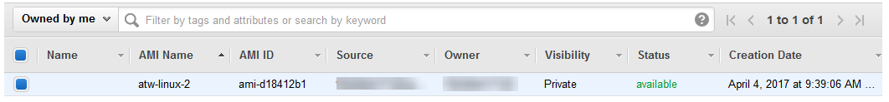

.. Copyright 2010-2017 Amazon.com, Inc. or its affiliates. All Rights Reserved.

   This work is licensed under a Creative Commons Attribution-NonCommercial-ShareAlike 4.0
   International License (the "License"). You may not use this file except in compliance with the
   License. A copy of the License is located at http://creativecommons.org/licenses/by-nc-sa/4.0/.

   This file is distributed on an "AS IS" BASIS, WITHOUT WARRANTIES OR CONDITIONS OF ANY KIND,
   either express or implied. See the License for the specific language governing permissions and
   limitations under the License.

.. _tkv-create-ami-from-instance:

#########################################
Create an AMI from an Amazon EC2 Instance
#########################################

.. meta::
   :description: How to use the Toolkit for Visual Studio to create an AMI from an EC2 instance.
   :keywords: AMI

From the :guilabel:`Amazon EC2 Instances` view, you can create Amazon Machine Images (AMIs) from
either running or stopped instances.

*To create an AMI from an instance*

1. Right-click the instance you want to use as the basis for your AMI, and choose :guilabel:`Create
   Image` from the context menu.

   .. figure:: images/tkv-ec2-create-ami-menu2.png
       :scale: 75

   :guilabel:`Create Image` context menu

2. In the :guilabel:`Create Image` dialog box, type a unique name and description, and then choose
   :guilabel:`Create Image`.

   .. figure:: images/tkv-ec2-create-ami-dlg2.png
       :scale: 75

   :guilabel:`Create Image` dialog box

It may take a few minutes for the AMI to be created. After it is created, it will appear in the
:guilabel:`AMIs` view in AWS Explorer. To display this view, double-click the :guilabel:`Amazon EC2
| AMIs` node in AWS Explorer. To see your AMIs, from the :guilabel:`Viewing` drop-down list, choose
:guilabel:`Owned By Me`. You may need to choose :guilabel:`Refresh` to see your AMI. When the AMI
first appears, it may be in a pending state, but after a few moments, it transitions to an available
state.

List of created AMIs

