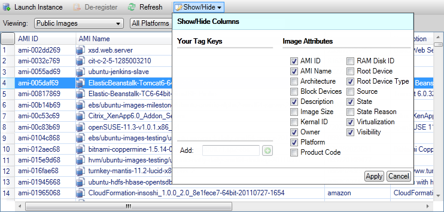

.. Copyright 2010-2016 Amazon.com, Inc. or its affiliates. All Rights Reserved.

   This work is licensed under a Creative Commons Attribution-NonCommercial-ShareAlike 4.0
   International License (the "License"). You may not use this file except in compliance with the
   License. A copy of the License is located at http://creativecommons.org/licenses/by-nc-sa/4.0/.

   This file is distributed on an "AS IS" BASIS, WITHOUT WARRANTIES OR CONDITIONS OF ANY KIND,
   either express or implied. See the License for the specific language governing permissions and
   limitations under the License.

.. _managing-ec2:

#############################
Managing Amazon EC2 Instances
#############################

.. meta::
   :description: Manage your EC2 instances with the AWS Toolkit for Visual Studio.
   :keywords: EC2, machine images, 

AWS Explorer provides detailed views of Amazon Machine Images (AMI) and |EC2long| (|EC2|) instances.
From these views, you can launch an |EC2| instance from an AMI, connect to that instance, and either
stop or terminate the instance, all from inside the Visual Studio development environment. You can
use the instances view to create AMIs from your instances. For more information, see
:ref:`tkv-create-ami-from-instance`.

.. _tkv-AMI-and-Instance-Views:

The Amazon Machine Images and Amazon EC2 Instances Views
========================================================

From AWS Explorer, you can display views of Amazon Machine Images (AMIs) and Amazon EC2 instances.
In AWS Explorer, expand the :guilabel:`Amazon EC2` node.

To display the AMIs view, on the first subnode, :guilabel:`AMIs`, open the context (right-click)
menu and then choose :guilabel:`View`.

To display the Amazon EC2 instances view, on the :guilabel:`Instances` node, open the context
(right-click) menu and then choose :guilabel:`View`.

You can also display either view by double-clicking the appropriate node.

* The views are scoped to the region specified in AWS Explorer (for example, the US West (N. California) 
  region).

* You can rearrange columns by clicking and dragging. To sort the values in a column, click the column
  heading.

* You can use the drop-down lists and filter box in :guilabel:`Viewing` to configure views. The
  initial view displays AMIs of any platform type (Windows or Linux) that are owned by the account
  specified in AWS Explorer.

*Show/Hide Columns*

You can also choose the :guilabel:`Show/Hide` drop-down at the top of the view to configure which
columns are displayed. Your choice of columns will persist if you close the view and reopen it.

:guilabel:`Show/Hide Columns` UI for AMI and Instances views

*Tagging AMIs, Instances, and Volumes*

You can also use the :guilabel:`Show/Hide` drop-down list to add tags for AMIs, |EC2| instances, or
volumes you own. Tags are name-value pairs that enable you to attach metadata to your AMIs,
instances, and volumes. Tag names are scoped both to your account and also separately to your AMIs
and instances. For example, there would be no conflict if you used the same tag name for your AMIs
and your instances. Tag names are not case-sensitive.

For more information about tags, go to :ec2-ug:`Using Tags <Using_Tags>` in the |EC2-ug|.

*To add a tag*

1. In the :guilabel:`Add` box, type a name for the tag. Choose the green button with the plus sign (+),
   and then choose :guilabel:`Apply`.

   .. figure:: images/tkv-ec2-add-tag.png
       :scale: 85

   Add a tag to an AMI or |EC2| instance

   The new tag is displayed in italic, which indicates no values have yet been associated with that
   tag.

   In the list view, the tag name appears as a new column. When at least one value has been
   associated with the tag, the tag will be visible in the :console:`AWS Console <ec2>`.

2. To add a value for the tag, double-click a cell in the column for that tag, and type a value. To
   delete the tag value, double-click the cell and delete the text.

   If you clear the tag in the :guilabel:`Show/Hide` drop-down list, the corresponding column
   disappears from the view. The tag is preserved, along with any tag values associated with AMIs,
   instances, or volumes.

   .. note:: If you clear a tag in the :guilabel:`Show/Hide` drop-down list that has no associated values, the
      AWS Toolkit will delete the tag entirely. It will no longer appear in the list view or in
      the :guilabel:`Show/Hide` drop-down list. To use that tag again, use the
      :guilabel:`Show/Hide` dialog box to re-create it.

.. _create-ec2:

Launching an Amazon EC2 Instance
================================

AWS Explorer provides all of the functionality required to launch an Amazon EC2 instance. In this
section, we'll select an Amazon Machine Image (AMI), configure it, and then start it as an Amazon
EC2 instance.

*To launch a Windows Server Amazon EC2 instance*

1. At the top of the AMIs view, in the drop-down list on the left, choose :guilabel:`Amazon Images`. In
   the drop-down list on the right, choose :guilabel:`Windows`. In the filter box, type :code:`ebs`
   for Elastic Block Storage. It may take a few moments for the view to be refreshed.

2. Choose an AMI in the list, open the context (right-click) menu, and then choose :guilabel:`Launch
   Instance`. .

   .. figure:: images/ami-launch-list.png
       :scale: 85

   AMI list

3. In the :guilabel:`Launch New Amazon EC2 Instance` dialog box, configure the AMI for your
   application.

   *Instance Type*
     Choose the type of the EC2 instance to launch. You can find a list of instance types and
     pricing information on the |ec2-pricing|_ page.

   *Name*
     Type a name for your instance. This name cannot be more than 256 characters.

   *Key Pair*
     A key pair is used to obtain the Windows password that you use to log in to the EC2 instance
     using Remote Desktop Protocol (RDP). Choose a key pair for which you have access to the
     private key, or choose the option to create a key pair. If you create the key pair in the
     Toolkit, the Toolkit can store the private key for you.

   *Security Group*
     The security group controls the type of network traffic the EC2 instance will accept. Choose
     a security group that will allow incoming traffic on port 3389, the port used by RDP, so
     that you can connect to the EC2 instance. For information about how to use the Toolkit to
     create security groups, see :ref:`tkv-sg-create`.

   *Instance Profile*
     The instance profile is a logical container for an IAM role. When you choose an instance
     profile, you associate the corresponding IAM role with the EC2 instance. IAM roles are
     configured with policies that specify access to AWS services and account resources. When an
     EC2 instance is associated with an IAM role, application software that runs on the instance
     runs with the permissions specified by the IAM role. This enables the application software
     to run without having to specify any AWS credentials of its own, which makes the software
     more secure. For more information about IAM roles, go to the 
     :iam-ug:`IAM User Guide <WorkingWithRoles>`.

   .. figure:: images/ami-launch-ui-new.png
       :scale: 85

   EC2 :guilabel:`Launch AMI` dialog box

4. Choose :guilabel:`Launch`.

   In AWS Explorer, on the :guilabel:`Instances` subnode of :guilabel:`Amazon EC2`, open the
   context (right-click) menu and then choose :guilabel:`View`. The AWS Toolkit displays the list
   of |EC2| instances associated with the active account. You may need to choose
   :guilabel:`Refresh` to see your new instance. When the instance first appears, it may be in a
   pending state, but after a few moments, it transitions to a running state.

   .. figure:: images/ami-running-ec2-instancs.png
       :scale: 85

.. _connect-ec2:

Connecting to an Amazon EC2 Instance
====================================

You can use Windows Remote Desktop to connect to a Windows Server instance. For authentication, the
AWS Toolkit enables you to retrieve the administrator password for the instance, or you can simply
use the stored key pair associated with the instance. In the following procedure, we'll use the
stored key pair.

*To connect to a Windows Server instance using Windows Remote Desktop*

1. In the EC2 instance list, right-click the Windows Server instance to which you want to connect. From
   the context menu, choose :guilabel:`Open Remote Desktop`.

   If you want to authenticate using the administrator password, you would choose :guilabel:`Get
   Windows Passwords`.

   .. figure:: images/tkv-ec2-rdp-menu.png
       :scale: 85

   EC2 Instance context menu

2. In the :guilabel:`Open Remote Desktop` dialog box, choose :guilabel:`Use EC2 keypair to log on`, and
   then choose :guilabel:`OK`.

   If you did not store a key pair with the AWS Toolkit, specify the PEM file that contains the
   private key.

   .. figure:: images/tkv-ec2-rdp-open.png
       :scale: 85

   :guilabel:`Open Remote Desktop` dialog box

3. The :guilabel:`Remote Desktop` window will open. You do not need to sign in because authentication
   occurred with the key pair. You will be running as the administrator on the |EC2| instance.

   If the EC2 instance has only recently started, you may not be able to connect for two possible
   reasons:

   * The Remote Desktop service might not yet be up and running. Wait a few minutes and try again.

   * Password information might not yet have been transferred to the instance. In this case, you will see
     a message box similar to the following.

   .. figure:: images/tkv-ec2-rdp-no-joy.png
       :scale: 85

   Password not yet available

   The following screenshot shows a user connected as administrator through Remote Desktop.

   .. figure:: images/tkv-ec2-rdt-desktop.png
       :scale: 85

   Remote Desktop

.. _ec2-end:

Ending an Amazon EC2 Instance
=============================

Using the AWS Toolkit, you can stop or terminate a running Amazon EC2 instance from Visual Studio.
To stop the instance, the EC2 instance must be using an |EBS| volume. If the EC2 instance is not
using an |EBS| volume, then your only option is to terminate the instance.

If you stop the instance, data stored on the EBS volume is retained. If you terminate the instance,
all data stored on the local storage device of the instance will be lost. In either case, stop or
terminate, you will not continue to be charged for the EC2 instance. However, if you stop an
instance, you will continue to be charged for the EBS storage that persists after the instance is
stopped.

Another possible way to end an instance is to use Remote Desktop to connect to the instance, and
then from the Windows :guilabel:`Start` menu, use :guilabel:`Shutdown`. You can configure the
instance to either stop or terminate in this scenario.

*To stop an Amazon EC2 instance*

1. In AWS Explorer, expand the :guilabel:`Amazon EC2` node, open the context (right-click) menu for
   :guilabel:`Instances`, and then choose :guilabel:`View`. In the :guilabel:`Instances` list,
   right-click the instance you want to stop and choose :guilabel:`Stop` from the context menu.
   Choose :guilabel:`Yes` to confirm you want to stop the instance.

   .. figure:: images/tkv-ec2-stop-menu.png
       :scale: 75

2. At the top of the :guilabel:`Instances` list, choose :guilabel:`Refresh` to see the change in the
   status of the Amazon EC2 instance. Because we stopped rather than terminated the instance, the
   EBS volume associated with the instance is still active.

   .. figure:: images/tkv-ec2-stopped.png
       :scale: 75

*Terminated Instances Remain Visible*

If you terminate an instance, it will continue to appear in the :guilabel:`Instance` list alongside
running or stopped instances. Eventually, AWS reclaims these instances and they disappear from the
list. You are not charged for instances in a terminated state.

.. figure:: images/tkv-ec2-instance-terminated-linger.png
    :scale: 75

*To specify the behavior of an EC2 instance at shutdown*

The AWS Toolkit enables you to specify whether an |EC2| instance will stop or terminate if
:guilabel:`Shutdown` is selected from the :guilabel:`Start` menu.

1. In the :guilabel:`Instances` list, right-click an Amazon EC2 instance, and then choose
   :guilabel:`Change shutdown behavior`.

   .. figure:: images/tkv-ec2-change-shutdown.png
       :scale: 75

   :guilabel:`Change Shutdown Behavior` menu item

2. In the :guilabel:`Change Shutdown Behavior` dialog box, from the :guilabel:`Shutdown Behavior`
   drop-down list, choose :guilabel:`Stop` or :guilabel:`Terminate`.

   .. figure:: images/tkv-ec2-change-shutdown-dlg.png
       :scale: 75
