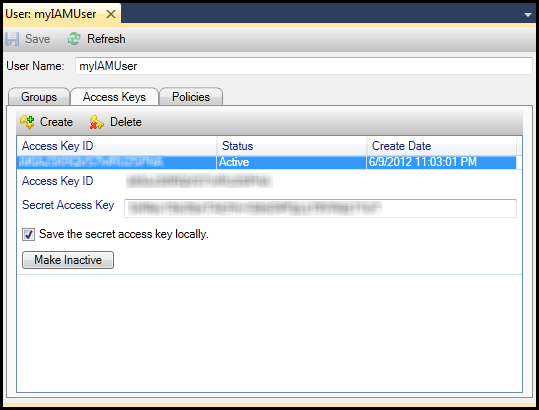
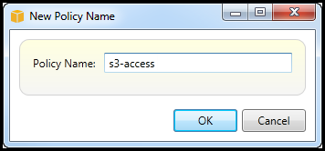
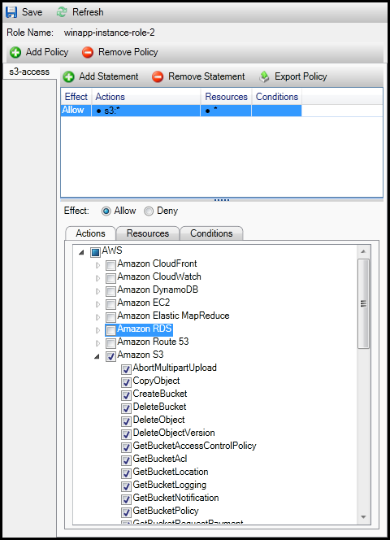

.. Copyright 2010-2018 Amazon.com, Inc. or its affiliates. All Rights Reserved.

   This work is licensed under a Creative Commons Attribution-NonCommercial-ShareAlike 4.0
   International License (the "License"). You may not use this file except in compliance with the
   License. A copy of the License is located at http://creativecommons.org/licenses/by-nc-sa/4.0/.

   This file is distributed on an "AS IS" BASIS, WITHOUT WARRANTIES OR CONDITIONS OF ANY KIND,
   either express or implied. See the License for the specific language governing permissions and
   limitations under the License.

.. _tkv-iam:

##############################
Identity and Access Management
##############################

.. meta::
   :description: Work with IAM from AWS Explorer.
   :keywords: IAM, security, user, group, role, policy

|IAMlong| (|IAM|) enables you to more securely manage access to your AWS accounts and resources.
With IAM, you can create multiple users in your primary (*root*) AWS account. These users can have
their own credentials: password, access key ID, and secret key, but all |IAM| users share a single
account number.

You can manage each |IAM| user's level of resource access by attaching |IAM| policies to the user.
For example, you can attach a policy to an |IAM| user that gives the user access to the |S3| service
and related resources in your account, but which doesn't provide access to any other services or
resources.

For more efficient access management, you can create |IAM| groups, which are collections of users.
When you attach a policy to the group, it will affect all users who are members of that group.

In addition to managing permissions at the user and group level, |IAM| also supports the concept of
|IAM| roles. Like users and groups, you can attach policies to |IAM| roles. You can then associate
the |IAM| role with an |EC2| instance. Applications that run on the EC2 instance are able to access
AWS using the permissions provided by the IAM role. For more information about using IAM roles with
the Toolkit, see :ref:`create-an-iam-role-tkv`. For more information about |IAM|, go to the 
:iam-ug:`IAM User Guide <Welcome>`.

.. _tkv-create-an-iam-user:

Create and Configure an IAM User
================================

|IAM| users enable you to grant others access to your AWS account. Because you are able to attach
policies to IAM users, you can precisely limit the resources an IAM user can access and the
operations they can perform on those resources.

As a best practice, all users who access an AWS account should do so as |IAM| users |mdash| even the
owner of the account. This ensures that if the credentials for one of the |IAM| users are
compromised, just those credentials can be deactivated. There is no need to deactivate or change the
root credentials for the account.

From the |TVS|, you can assign permissions to an |IAM| user either by attaching an IAM policy to
the user or by assigning the user to a group. |IAM| users who are assigned to a group derive their
permissions from the policies attached to the group. For more information, see
:ref:`create-an-iam-group-tkv` and :ref:`add-an-iam-user-to-an-iam-group-tkv`.

From the |TVS|, you can also generate AWS credentials (access key ID and secret key) for the |IAM|
user. For more information, see :ref:`generate-credentials-for-an-iam-user-tkv`

The |TVS| supports specifying |IAM| user credentials for accessing services through AWS Explorer.
Because |IAM| users typically do not have full access to all AWS services, some of the functionality
in AWS Explorer might not be available. If you use AWS Explorer to change resources while the active
account is an |IAM| user and then switch the active account to the root account, the changes might
not be visible until you refresh the view in AWS Explorer. To refresh the view, choose the refresh
() button.

For information about how to configure |IAM| users from the AWS Management Console, go to 
:iam-ug:`Working with Users and Groups <Using_WorkingWithGroupsAndUsers>` in the
IAM User Guide.

*To create an IAM user*

1. In AWS Explorer, expand the :guilabel:`AWS Identity and Access Management` node, open the context
   (right-click) menu for :guilabel:`Users` and then choose :guilabel:`Create User`.

2. In the :guilabel:`Create User` dialog box, type a name for the |IAM| user and choose :guilabel:`OK`.
   This is the |IAM| :iam-ug:`friendly name <Using_Identifiers>`. For information about constraints 
   on names for |IAM| users, go to the :iam-ug:`IAM User Guide <LimitationsOnEntities>`.

   .. figure:: images/iam-user-create-dlg.png
      :scale: 85

      Create an |IAM| user

The new user will appear as a subnode under :guilabel:`Users` under the :guilabel:`AWS Identity and
Access Management` node.

For information about how to create a policy and attach it to the user, see
:ref:`tkv-create-an-iam-policy`.

.. _create-an-iam-group-tkv:

Create an IAM Group
===================

Groups provide a way of applying |IAM| policies to a collection of users. For information about how
to manage |IAM| users and groups, go to 
:iam-ug:`Working with Users and Groups <Using_WorkingWithGroupsAndUsers>` in the |IAM| User Guide.

*To create an IAM group*

1. In AWS Explorer, under :guilabel:`Identity and Access Management`, open the context (right-click)
   menu for :guilabel:`Groups` and choose :guilabel:`Create Group`.

2. In the :guilabel:`Create Group` dialog box, type a name for the |IAM| group and choose
   :guilabel:`OK`.

   .. figure:: images/iam-group-create-dlg.png
      :scale: 85

      Create |IAM| group

The new |IAM| group will appear under the :guilabel:`Groups` subnode of :guilabel:`Identity and
Access Management`.

For information about to create a policy and attach it to the |IAM| group, see
:ref:`tkv-create-an-iam-policy`.

.. _add-an-iam-user-to-an-iam-group-tkv:

Add an |IAM| User to an |IAM| Group
===================================

|IAM| users who are members of an |IAM| group derive access permissions from the policies attached
to the group. The purpose of an |IAM| group is to make it easier to manage permissions across a
collection of |IAM| users.

For information about how the policies attached to an |IAM| group interact with the policies
attached to |IAM| users who are members of that |IAM| group, go to 
:iam-ug:`Managing IAM Policies in the IAM User Guide <ManagingPolicies>`.

In AWS Explorer, you add |IAM| users to |IAM| groups from the :guilabel:`Users` subnode, not the
:guilabel:`Groups` subnode.

*To add an IAM user to a IAM group*

1. In AWS Explorer, under :guilabel:`Identity and Access Management`, open the context (right-click)
   menu for :guilabel:`Users` and choose :guilabel:`Edit`.

   .. figure:: images/iam-group-assign.png
      :scale: 85

      Assign an |IAM| user to a |IAM| group

2. The left pane of the :guilabel:`Groups` tab displays the available |IAM| groups. The right pane
   displays the groups of which the specified |IAM| user is already a member.

   To add the |IAM| user to a group, in the left pane, choose the |IAM| group and then choose the
   :guilabel:`>` button.

   To remove the |IAM| user from a group, in the right pane, choose the |IAM| group and then choose
   the :guilabel:`<` button.

   To add the |IAM| user to all of the |IAM| groups, choose the :guilabel:`>>` button. Similarly,
   to remove the |IAM| user from all of the groups, choose the :guilabel:`<<` button.

   To choose multiple groups, choose them in sequence. You do not need to hold down the Control
   key. To clear a group from your selection, simply choose it a second time.

3. When you have finished assigning the |IAM| user to |IAM| groups, choose :guilabel:`Save`.

.. _generate-credentials-for-an-iam-user-tkv:

Generate Credentials for an |IAM| User
======================================

With |TVS|, you can generate the access key ID and secret key used to make API calls to AWS. These
keys can also be specified to access AWS services through the Toolkit. For more information about
how to specify credentials for use with the Toolkit, see :ref:`creds`. For more information about
how to safely handle credentials, see 
:aws-gr:`Best Practices for Managing AWS Access Keys <aws-access-keys-best-practices>`.

The Toolkit cannot be used to generate a password for an |IAM| user.

*To generate credentials for an IAM user*

1. In AWS Explorer, open the context (right-click) menu for an |IAM| user and choose :guilabel:`Edit`.

   .. figure:: images/iam-user-creds-list.png
      :scale: 85

2. To generate credentials, on the :guilabel:`Access Keys` tab, choose :guilabel:`Create`.

   You can generate only two sets of credentials per |IAM| user. If you already have two sets of
   credentials and need to create an additional set, you must delete one of the existing sets.

   .. figure:: images/iam-user-creds-create.png
     :scale: 85

     reate credentials for |IAM| user

   If you want the Toolkit to save an encrypted copy of your secret access key to your local drive,
   select :guilabel:`Save the secret access key locally. AWS only returns the secret access key
   when created`. You can also copy the secret access key from the dialog box and save it in a
   secure location.

3. Choose :guilabel:`OK`.

After you generate the credentials, you can view them from the :guilabel:`Access Keys` tab. If you
selected the option to have the Toolkit save the secret key locally, it will be displayed here.

   Create credentials for |IAM| user

If you saved the secret key yourself and would also like the Toolkit to save it, in the
:guilabel:`Secret Access Key` box, type the secret access key, and then select :guilabel:`Save the
secret access key locally`.

To deactivate the credentials, choose :guilabel:`Make Inactive`. (You might do this if you suspect
the credentials have been compromised. You can reactivate the credentials if you receive an
assurance they are secure.)

.. _create-an-iam-role-tkv:

Create an |IAM| Role
====================

The |TVS| supports the creation and configuration of |IAM| roles. Just as with users and groups, you
can attach policies to |IAM| roles. You can then associate the |IAM| role with an |EC2| instance.
The association with the EC2 instance is handled through an *instance profile*, which is a logical
container for the role. Applications that run on the EC2 instance are automatically granted the
level of access specified by the policy associated with the |IAM| role. This is true even when the
application hasn't specified other AWS credentials.

For example, you can create a role and attach a policy to that role that limits access to |S3| only.
After associating this role with an EC2 instance, you can then run an application on that instance
and the application will have access to |S3|, but not to any other services or resources. The
advantage of this approach is that you don't need to be concerned with securely transferring and
storing AWS credentials on the EC2 instance.

For more information about |IAM| roles, go to :iam-ug:`Working with IAM Roles in the IAM User Guide 
<WorkingWithRoles>`. For examples of programs accessing AWS using
the |IAM| role associated with an |EC2| instance, go to the AWS developer guides for 
:sdk-java-dg:`Java <java-dg-hands-off-secret-management>`, 
:sdk-net-dg:`.NET <net-dg-hands-off-secret-management>`, 
:sdk-php-dg-v3:`PHP <php-dg-hands-off-secret-management>`, and 
:sdk-ruby1-dg:`Ruby <setup-config>`.

*To create an IAM role*

1. In AWS Explorer, under :guilabel:`Identity and Access Management`, open the context (right-click)
   menu for :guilabel:`Roles` and then choose :guilabel:`Create Roles`.

2. In the :guilabel:`Create Role` dialog box, type a name for the |IAM| role and choose :guilabel:`OK`.

   .. figure:: images/iam-role-create-dlg.png
      :scale: 85

      Create |IAM| role

The new |IAM| role will appears under :guilabel:`Roles` in :guilabel:`Identity and Access
Management`.

For information about how to create a policy and attach it to the role, see
:ref:`tkv-create-an-iam-policy`.

.. _tkv-create-an-iam-policy:

Create an |IAM| Policy
======================

Policies are fundamental to |IAM|. Policies can be associated with |IAM| *entities* such users,
groups, or roles. Policies specify the level of access enabled for a user, group, or role.

*To create an IAM policy*

In AWS Explorer, expand the :guilabel:`AWS Identity and Access Management` node, then expand the
node for the type of entity (:guilabel:`Groups`, :guilabel:`Roles`, or :guilabel:`Users`) to which
you will attach the policy. For example, open a context menu for an |IAM| role and choose
:guilabel:`Edit`.

A tab associated with the role will appear in the AWS Explorer. Choose the :guilabel:`Add Policy`
link.

In the :guilabel:`New Policy Name` dialog box, type a name for the policy (for example, s3-access).

   New Policy Name dialog box

In the policy editor, add policy statements to specify the level of access to provide to the role
(in this example, winapp-instance-role-2 associated with the policy. In this example, a policy
provides full access to |S3|, but no access to any other resources.

   Specify |IAM| policy

For more precise access control, you can expand the subnodes in the policy editor to allow or
disallow actions associated with AWS services.

When you have edited the policy, choose the :guilabel:`Save` link.

