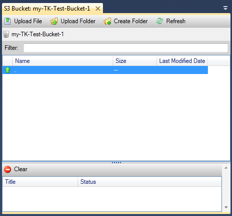
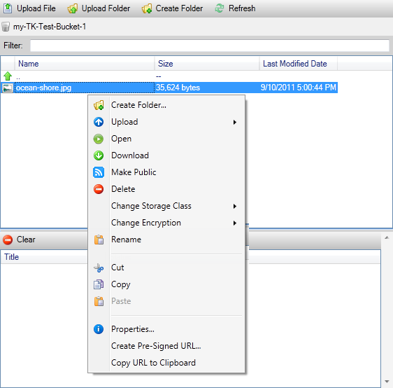

.. Copyright 2010-2018 Amazon.com, Inc. or its affiliates. All Rights Reserved.

   This work is licensed under a Creative Commons Attribution-NonCommercial-ShareAlike 4.0
   International License (the "License"). You may not use this file except in compliance with the
   License. A copy of the License is located at http://creativecommons.org/licenses/by-nc-sa/4.0/.

   This file is distributed on an "AS IS" BASIS, WITHOUT WARRANTIES OR CONDITIONS OF ANY KIND,
   either express or implied. See the License for the specific language governing permissions and
   limitations under the License.

.. _using-s3:

############################
Using |S3| from AWS Explorer
############################

.. meta::
   :description: Using S3 from AWS Explorer.
   :keywords: S3, files, folders

|S3long| (|S3|) enables you to store and retrieve data from any connection to the Internet. All data
you store on |S3| is associated with your account and, by default, can only be accessed by you. The
|TVS| enables you to store data on |S3| and to view, manage, retrieve, and distribute that data.

|S3| uses the concept of buckets, which you can think of as being similar to file systems or logical
drives. Buckets can contain folders, which are similar to directories, and objects, which are
similar to files. In this section, we'll be using these concepts as we walk through the |S3|
functionality exposed by the |TVS|.

.. note:: To use this tool, your |IAM| policy must grant permissions for the :code:`s3:GetBucketAcl`,
   :code:`s3:GetBucket`, and :code:`s3:ListBucket` actions. For more information, see 
   :iam-ug:`Overview of AWS IAM Policies <PoliciesOverview>`.

.. _create-s3-bucket:

Creating an |S3| Bucket
=======================

The bucket is most fundamental unit of storage in |S3|.

**To create an S3 bucket**

1. In AWS Explorer, open the context (right-click) menu for the :guilabel:`Amazon S3` node, and then
   choose :guilabel:`Create Bucket`.

2. In the :guilabel:`Create Bucket` dialog box, type a name for the bucket. Bucket names must be unique
   across AWS. For information about other constraints, go to the 
   :s3-dg:`Amazon S3 documentation <BucketRestrictions>`.

3. Choose :guilabel:`OK`.

.. _managing-s3-buckets:

Managing |S3| Buckets from AWS Explorer
=======================================

In AWS Explorer, the following operations are available when you open a context (right-click) menu
for an |S3| bucket.

*Browse*

Displays a view of the objects contained in the bucket. From here, you can create folders or upload
files or entire directories and folders from your local computer. The lower pane displays status
messages about the upload process. To clear these messages, choose the :guilabel:`Clear` icon. You
can also access this view of the bucket by double-clicking the bucket name in AWS Explorer.

*Properties*

Displays a dialog box where you can do the following:

* Set |S3| permissions that scope to:

  * you as the bucket owner.

  * all users who have been authenticated on AWS.

  * everyone with Internet access.

* Turn on logging for the bucket.

* Set up a notification using the |SNSlong| (|SNS|) so that if you are using Reduced Redundancy
  Storage (RRS), you are notified if data loss occurs. RRS is an |S3| storage option that provides
  less durability than standard storage, but at reduced cost. For more information, see 
  :s3-faq:`S3 FAQs <#What_is_RRS>`.

* Create a static website using the data in the bucket.

*Policy*

Enables you to set up |IAMlong| (IAM) policies for your bucket. For more information, go to the 
:iam-ug:`IAM documentation <IAM_Overview>` and the use cases for :iam-ug:`IAM <IAM_UseCases>` and
:s3-dg:`S3 <AccessPolicyLanguage_UseCases_s3_a>`.

*Create Pre-Signed URL*

Enables you to generate a time-limited URL you can distribute to provide access to the contents of
the bucket. For more information, see :ref:`s3-pre-sign-create`.

*View Multi-Part Uploads*

Enables you to view multipart uploads. |S3| supports breaking large object uploads into parts to
make the upload process more efficient. For more information, go to the discussion of 
:s3-dg:`multipart uploads in the S3 documentation <uploadobjusingmpu>`.

*Delete*

Enables you to delete the bucket. You can only delete empty buckets.

.. _upload-s3-files:

Uploading Files and Folders to |S3|
===================================

You can use AWS Explorer to transfer files or entire folders from your local computer to any of your
buckets.

.. note:: If you upload files or folders that have the same name as files or folders that already exist in the
   |S3| bucket, your uploaded files will overwrite the existing files without warning.

**To upload a file to S3**

1. In AWS Explorer, expand the :guilabel:`Amazon S3` node, and double-click a bucket or open the
   context (right-click) menu for the bucket and choose :guilabel:`Browse`.

2. In the :guilabel:`Browse` view of your bucket, choose :guilabel:`Upload File` or :guilabel:`Upload 
   Folder`.

3. In the :guilabel:`File-Open` dialog box, navigate to the files to upload, choose them, and then
   choose :guilabel:`Open`. If you are uploading a folder, navigate to and choose that folder, and
   then choose :guilabel:`Open`.

   The :guilabel:`Upload Settings` dialog box enables you to set metadata and permissions on the
   files or folder you are uploading. Selecting the :guilabel:`Make everything public` check box is
   equivalent to setting :guilabel:`Open/Download` permissions to :guilabel:`Everyone`. You can
   select the option to use :s3-faq:`Reduced Redundancy Storage <#What_is_RRS>` for the
   uploaded files.

   .. figure:: images/tkv-s3-file-upload.png
       :scale: 85

   .. figure:: images/tkv-s3-file-upload-complete.png
       :scale: 85

.. _tkv-s3-file-ops:

|S3| File Operations from AWS Toolkit for Visual Studio
=======================================================

If you choose a file in the |S3| view and open the context (right-click) menu, you can perform
various operations on the file.

*Create Folder*

Enables you to create a folder in the current bucket. (Equivalent to choosing the :guilabel:`Create
Folder` link.)

*Upload*

Enables you to upload files or folders. (Equivalent to choosing the :guilabel:`Upload File` or
:guilabel:`Upload Folder` links.)

*Open*

Attempts to open the selected file in your default browser. Depending on the type of file and your
default browser's capabilities, the file might not be displayed. It might simply be downloaded by
your browser instead.

*Download*

Opens a :guilabel:`Folder-Tree` dialog box to enable you to download the selected file.

*Make Public*

Sets permissions on the selected file to :guilabel:`Open/Download` and :guilabel:`Everyone`.
(Equivalent to selecting the :guilabel:`Make everything public` check box on the :guilabel:`Upload
Settings` dialog box.)

*Delete*

Deletes the selected files or folders. You can also delete files or folders by choosing them and
pressing :kbd:`Delete`.

*Change Storage Class*

Sets the storage class to either Standard or Reduced Redundancy Storage (RRS). To view the current
storage class setting, choose :guilabel:`Properties`.

*Change Encryption*

Enables you to set server-side encryption on the file. To view the current encryption setting,
choose :guilabel:`Properties`.

*Rename*

Enables you to rename a file. You cannot rename a folder.

*Cut | Copy | Paste*

Enables you to cut, copy, and paste files or folders between folders or between buckets.

*Properties*

Displays a dialog box that enables you to set metadata and permissions for the file, as well as
toggle storage for the file between Reduced Redundancy Storage (RRS) and Standard, and set
server-side encryption for the file. This dialog box also displays an https link to the file. If you
choose this link, the |TVS| opens the file in your default browser. If you have permissions on
the file set to :guilabel:`Open/Download` and :guilabel:`Everyone`, other people will be able to
access the file through this link. Rather than distributing this link, we recommend you create and
distribute pre-signed URLs.

.. figure:: images/tkv-s3-properties-file.png
    :scale: 85

*Create Pre-Signed URL*

Enables you to create a time-limited pre-signed URL that you can distribute to enable other people
to access the content you have stored on |S3|.

.. _s3-pre-sign-create:

How to Create a Pre-Signed URL
------------------------------

You can create a pre-signed URL for a bucket or files in a bucket. Other people can then use this
URL to access the bucket or file. The URL will expire after a period of time that you specify when
you create the URL.

**To create a pre-signed URL**

1. In the :guilabel:`Create Pre-Signed URL` dialog box, set the expiration date and time for the URL.
   The default setting is one hour from the current time.

2. Choose the :guilabel:`Generate` button.

3. To copy the URL to the clipboard, choose :guilabel:`Copy`.

   .. figure:: images/tkv-s3-presigned-url.png
      :scale: 85

