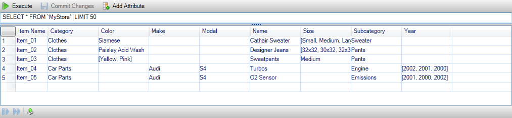
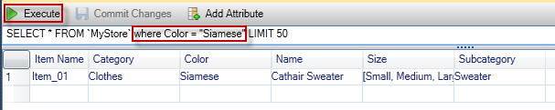
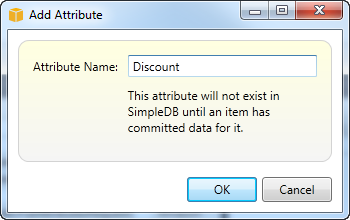
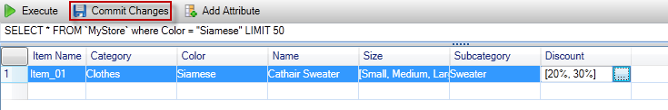

.. Copyright 2010-2016 Amazon.com, Inc. or its affiliates. All Rights Reserved.

   This work is licensed under a Creative Commons Attribution-NonCommercial-ShareAlike 4.0
   International License (the "License"). You may not use this file except in compliance with the
   License. A copy of the License is located at http://creativecommons.org/licenses/by-nc-sa/4.0/.

   This file is distributed on an "AS IS" BASIS, WITHOUT WARRANTIES OR CONDITIONS OF ANY KIND,
   either express or implied. See the License for the specific language governing permissions and
   limitations under the License.

.. _tkv-SimpleDB:

#############################
Using |SDB| from AWS Explorer
#############################

AWS Explorer displays all of the |SDB| domains associated with the active AWS account. From AWS
Explorer, you can create or delete |SDB| domains.

.. figure:: images/tkv-simpleDB-explorer.png
   :scale: 85

   Create, delete, or open |SDB| domains associated with your account

*Executing Queries and Editing the Results*

AWS Explorer can also display a grid view of a |SDB| domain from which you can view the items,
attributes, and values in that domain. You can execute queries so that only a subset of the domain's
items is displayed. By double-clicking a cell, you can edit the values for that item's corresponding
attribute. You can also add new attributes to the domain.

The domain displayed here is from the |SDB| sample included with the |sdk-net|.

   |SDB| grid view

To execute a query, edit the query in the text box at the top of the grid view, and then choose
:guilabel:`Execute`. The view is filtered to show only the items that match the query.

   Execute query from AWS Explorer

To edit the values associated with an attribute, double-click the corresponding cell, edit the
values, and then choose :guilabel:`Commit Changes`.

*Adding an Attribute*

To add an attribute, at the top of the view, choose :guilabel:`Add Attribute`.

   :guilabel:`Add Attribute` dialog box

To make the attribute part of the domain, you must add a value for it to at least one item and then
choose :guilabel:`Commit Changes`.

   Commit changes for a new attribute

*Paginating Query Results*

There are three buttons at the bottom of the view.

.. figure:: images/tkv-simpleDB-paginate-export.png
   :scale: 85

   Paginate and export buttons

The first two buttons provide pagination for query results. To display an additional page of
results, choose the first button. To display an additional ten pages of results, choose the second
button. In this context, a page is equal to 100 rows or the number of results specified by the LIMIT
value, if it is included in the query.

*Export to CSV*

The last button exports the current results to a CSV file.

