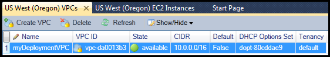
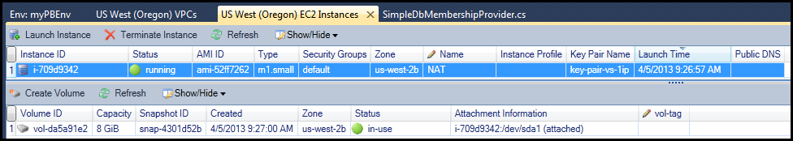

.. Copyright 2010-2017 Amazon.com, Inc. or its affiliates. All Rights Reserved.

   This work is licensed under a Creative Commons Attribution-NonCommercial-ShareAlike 4.0
   International License (the "License"). You may not use this file except in compliance with the
   License. A copy of the License is located at http://creativecommons.org/licenses/by-nc-sa/4.0/.

   This file is distributed on an "AS IS" BASIS, WITHOUT WARRANTIES OR CONDITIONS OF ANY KIND,
   either express or implied. See the License for the specific language governing permissions and
   limitations under the License.

.. _tkv-vpc:

##################################
Amazon Virtual Private Cloud (VPC)
##################################

.. meta::
   :description: Use the Toolkit for Visual Studio to manage Amazon Virtual Private Cloud.
   :keywords: Virtual Private Cloud, VPC, subnet, elastic IP, route tables, internet gateways

|VPClong| (|VPC|) enables you to launch Amazon Web Services (AWS) resources into a virtual network
you've defined. This virtual network resembles a traditional network that you'd operate in your own
data center, with the benefits of using the scalable infrastructure of AWS. For more information, go
to the |VPC-ug|_.

The |TVS| enables a developer to access VPC functionality similar to that exposed by the |console|_ 
but from the Visual Studio development environment. The
:guilabel:`Amazon VPC` node of AWS Explorer includes subnodes for the following areas.

* :vpc-ug:`VPCs <VPC_Introduction>`

* :vpc-ug:`Subnets <VPC_Subnets>`

* :vpc-ug:`Elastic IPs <vpc-ip-addressing>`

* :vpc-ug:`Internet Gateways <VPC_Internet_Gateway>`

* :vpc-ug:`Network ACLs <VPC_ACLs>`

* :vpc-ug:`Route Tables <VPC_Route_Tables>`

* :vpc-ug:`Security Groups <VPC_SecurityGroups>`

.. _tkv-vpc-pub-pri:

Walkthrough: How to Create a Public-Private VPC for Deployment with AWS Elastic Beanstalk
=========================================================================================

This section describes how to create an |VPC| that contains both public and private subnets. The
public subnet contains an |EC2| instance that performs network address translation (NAT) to enable
instances in the private subnet to communicate with the public internet. The two subnets must reside
in the same Availability Zone (AZ).

This is the minimal VPC configuration required to deploy an |AEBlong| environment in a VPC. In this
scenario, the |EC2| instances that host your application reside in the private subnet; the |ELB|
load balancer that routes incoming traffic to your application resides in the public subnet.

For more information about network address translation (NAT), go to :vpc-ug:`NAT Instances 
<VPC_NAT_Instance>` in the *Amazon Virtual Private Cloud User Guide*. For an example of how to
configure your deployment to use a VPC, see :ref:`tkv-deploy-beanstalk`.

**To create a public-private subnet VPC**

1. In the :guilabel:`Amazon VPC` node in AWS Explorer, open the :guilabel:`VPCs` subnode, then choose 
   :guilabel:`Create VPC`.

   .. figure:: images/vpc-vpcs-aws-explorer.png
       :scale: 75

2. Configure the VPC as follows:

   * Type a name for your VPC.

   * Select the :guilabel:`With Public Subnet` and the :guilabel:`With Private Subnet` check boxes.

   * From the :guilabel:`Availability Zone` drop-down list box for each subnet, choose an Availability 
     Zone. Be sure to use the same AZ for both subnets.

   * For the private subnet, in :guilabel:`NAT Key Pair Name`, provide a key pair. This key pair is used 
     for the |EC2| instance that performs network address translation from the private subnet to 
     the public Internet. 

   * Select the :guilabel:`Configure default security group to allow traffic to NAT` check box.

   Type a name for your VPC. Select the :guilabel:`With Public Subnet` and the :guilabel:`With 
   Private Subnet` check boxes. From the :guilabel:`Availability Zone` drop-down list box for each
   subnet, choose an Availability Zone. Be sure to use the same AZ for both subnets. For the
   private subnet, in :guilabel:`NAT Key Pair Name`, provide a key pair. This key pair is used for
   the |EC2| instance that performs network address translation from the private subnet to the
   public Internet. Select the :guilabel:`Configure default security group to allow traffic to NAT`
   check box.
   
   Choose :guilabel:`OK`.

    .. figure:: images/vpc-create.png
        :scale: 75

You can view the new VPC in the :guilabel:`VPCs` tab in AWS Explorer.

The NAT instance might take a few minutes to launch. When it is available, you can view it by
expanding the :guilabel:`Amazon EC2` node in AWS Explorer and then opening the :guilabel:`Instances`
subnode.

An |EBlong| (|EBS|) volume is created for the NAT instance automatically. For more information
about |EB|, go to :ec2-ug:`AWS Elastic Beanstalk (EBS) <AmazonEBS>` in the |EC2-ug|.

If you :ref:`deploy an application to an AWS Elastic Beanstalk environment <tkv-deploy-beanstalk>`
and choose to launch the environment in a VPC, the Toolkit will populate the :guilabel:`Publish to
AWS` dialog box with the configuration information for your VPC.

The Toolkit populates the dialog box with information only from VPCs that were created in the
Toolkit, not from VPCs created using the AWS Management Console. This is because when the Toolkit
creates a VPC, it tags the components of the VPC so that it can access their information.

The following screenshot from the Deployment Wizard shows an example of a dialog box populated with
values from a VPC created in the Toolkit.

.. figure:: images/deploy-pb-aeb-vpc-from-tkv.png
    :scale: 75

**To delete a VPC**

To delete the VPC, you must first terminate any |EC2| instances in the VPC.

1. If you have deployed an application to an |AEBlong| environment in the VPC, delete the environment.
   This will terminate any |EC2| instances hosting your application along with the |ELB| load
   balancer.

   If you attempt to directly terminate the instances hosting your application without deleting the
   environment, the |AS| service will automatically create new instances to replace the deleted
   ones. For more information, go to the 
   `Auto Scaling Developer Guide <http://docs.aws.amazon.com/autoscaling/latest/userguide/WhatIsAutoScaling.html>`_.

2. Delete the NAT instance for the VPC.

   You do not need to delete the |EBS| volume associated with the NAT instance in order to delete
   the VPC. However, if you do not delete the volume, you will continue to be charged for it even
   if you delete the NAT instance and the VPC.

3. On the :guilabel:`VPC` tab, choose the :guilabel:`Delete` link to delete the VPC.

   .. figure:: images/vpc-delete-link.png
       :scale: 75

4. In the :guilabel:`Delete VPC` dialog box, choose :guilabel:`OK`.

   .. figure:: images/vpc-delete.png
       :scale: 75

